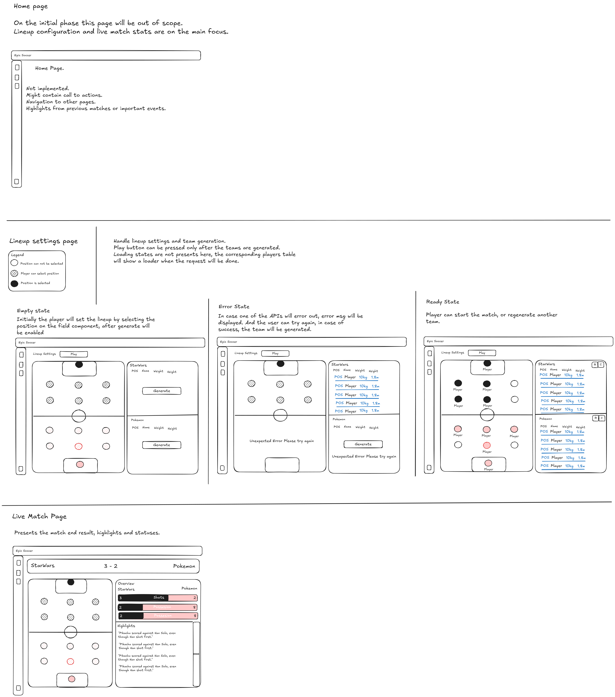
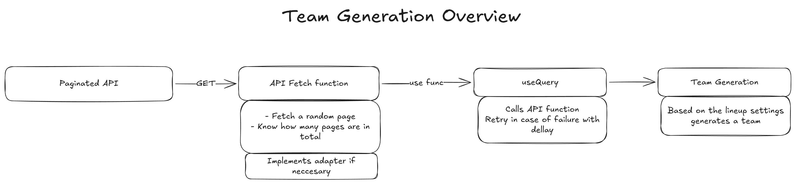
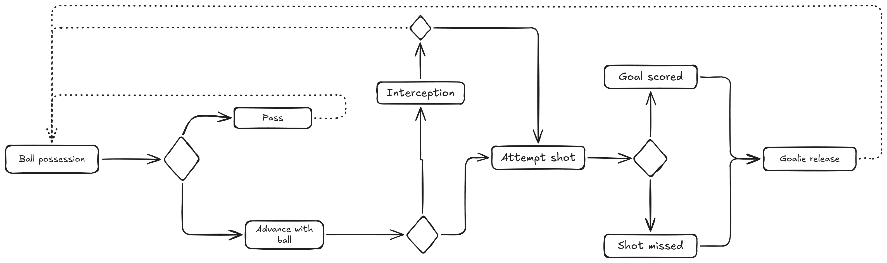

# Super Soccer Showdown

Star Wars vs Pokémon — a galactic soccer tournament to settle which universe reigns supreme.

## UX



2 main pages — **Lineup Settings** and **Live Match**. A home/landing page was considered out of scope.

**Lineup Settings** — configure and generate teams. Play button only appears after both teams are ready.

3 states per team:
- Empty — pick a universe, Generate becomes available
- Loading — spinner in the player table (not on the field)
- Error — API failure message + Retry button
- Ready — players on the field, can play or regenerate

**Live Match** — score bar, match simulation output (score per team)

---

## Tech Stack

- React 19
- TypeScript
- React Router 7
- TanStack React Query 4
- TailwindCSS 4
- Vite

---

## Architecture

### State

Two layers:
- `MatchProvider` (context) — keeps home/away teams alive across route changes
- Local state — lineup config (defenders, attackers) stays in the component

React Query handles async lifecycle: loading, error, caching. `staleTime: Infinity` so teams don't get silently refetched mid-session.

### APIs

Plain `fetch`, no axios. Two files in `/src/api/`:
- `pokemon.ts` — PokeAPI
- `starwars.ts` — SWAPI

Both APIs are paginated. Each fetch picks a random page, normalises the raw data into `RawCandidate` via an adapter, and passes it to the team generation logic.

### Flow

```
user triggers generate
  → useGenerateTeam (react-query, 3 retries @ 1s delay)
    → /src/api/*
      → generateTeam.ts (pure fn)
        → MatchProvider
          → Live Match page
```

All business logic lives in `/src/logic/` as pure functions — no React imports, fully testable in isolation.

### Team Generation



Given a pool of candidates and a `Lineup` config:
1. **Goalie** — the tallest candidate
2. **Defence** — the N heaviest remaining candidates (N = `lineup.defenders`, 1–3)
3. **Offence** — the N shortest remaining candidates (N = `lineup.attackers`, 1–3)

Total team size is always `1 + defenders + attackers` (max 7, default 5 with 2+2).

### Match Simulation



Implemented as a state machine in `generateMatch.ts`. Runs 90 "minutes", each producing a `SoccerEvent` (`ballPossession`, `pass`, `interception`, `attemptShot`, `goalScored`, etc.). `computeMatchOverview.ts` reduces the action list into per-team stats (score, passes, shots).

---

## What Was Treated as Core

| Feature | Status |
|---|---|
| Team generation logic (pure, tested) | Done |
| Position rules (Goalie = tallest, Defence = heaviest, Offence = shortest) | Done |
| Configurable lineup (defenders / attackers ratio) | Done |
| SWAPI + PokeAPI integration | Done |
| Loading, error, empty states | Done |
| API retry with back-off (3 retries, 1 s delay) | Done |
| Match simulation state machine | Done |
| Score display after match | Done |
| Unit tests for all logic modules | Done |

---

## What Was Left Out and Why

### Match highlights list
`generateMatch` produces a full action log (90 events with player names), but `MatchResults` only renders the score bar. Wiring up the highlights list — "Pikachu scored against Han Solo, even though Han shot first" is the next step.

### Universe-specific theming
The layout uses neutral Tailwind styles throughout.

### Home / landing page
Explicitly out of scope. The app opens directly to Lineup Settings, which is the first meaningful action a user can take.


### Responsiveness
Not implemented, will require a mocks.

### Extensibility for new universes
Adding a third universe (Lord of the Rings, Marvel, etc.) currently requires edits in three places: `domain.ts`, `useGenerateTeam.ts`, and `TeamGeneration.tsx`. The right fix is a universe registry — a map of `Universe → { fetchCandidates, displayName, theme }` — which would make each new universe a one-liner. Skipped as premature abstraction given two universes.

### Performance
No bundle analysis or lazy-loading was done. The app is small enough that it's not a meaningful concern yet.

---

## Running Locally

```bash
npm install
npm run dev
```

Tests:

```bash
npm test
```
